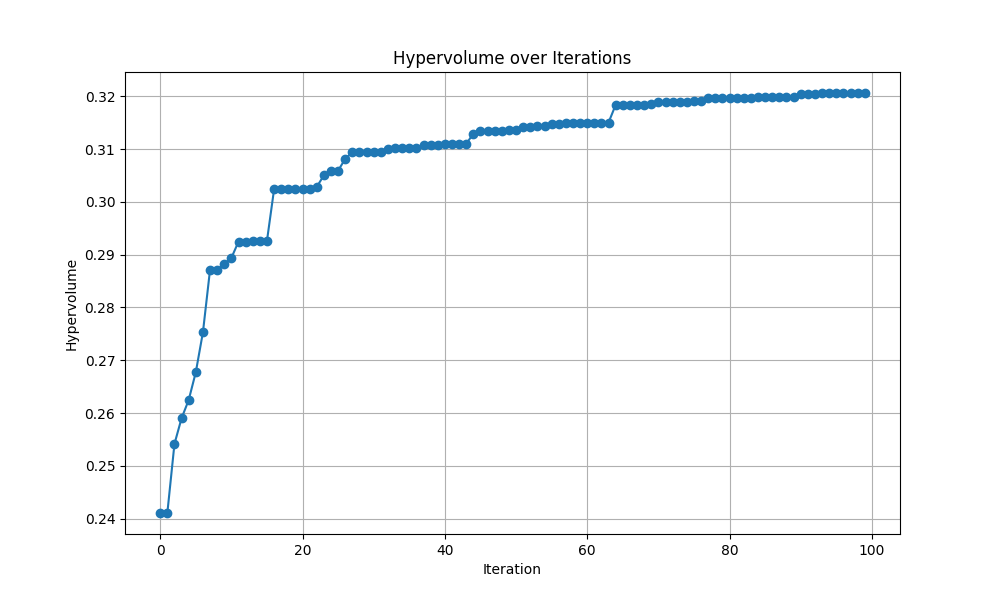
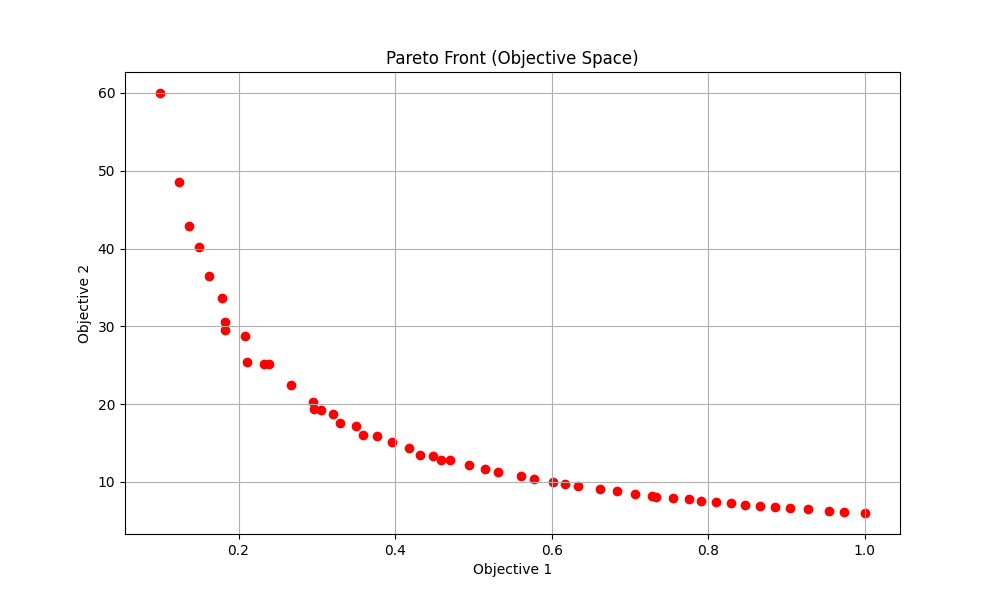
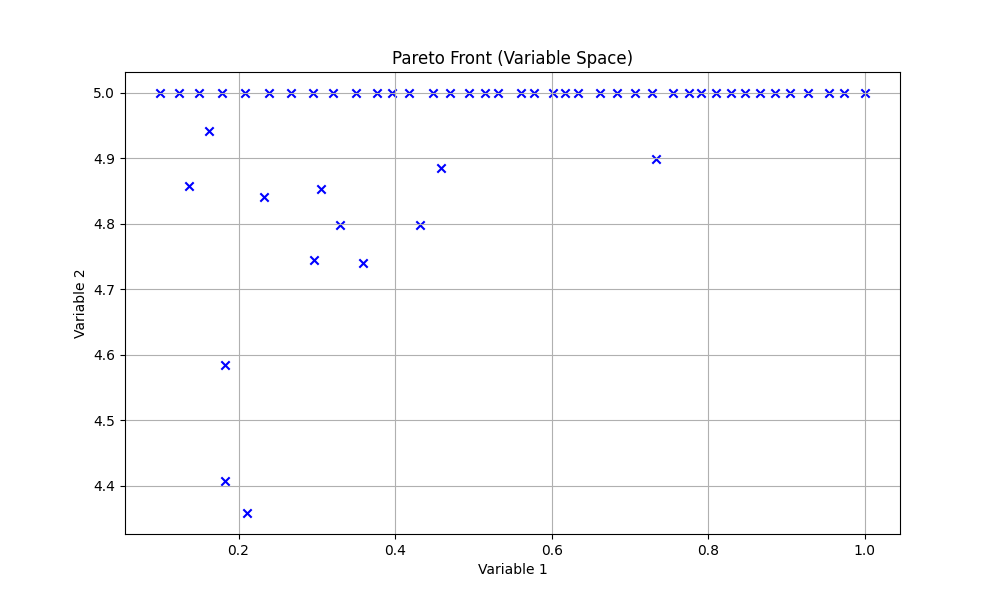

# BoTorch_MOBO_example
A case of parallel solution of multi-objective Bayesian optimisation (MOBO) implemented on the GPU using the BoTorch library.
一个使用BoTorch库在GPU上实现的多目标贝叶斯优化(MOBO)并行求解案例。

### File list
* mymoo1.py: Executable file
* hypervolume.png: Changes in the hypervolume during the optimisation process
* pareto_objective.png: Pareto frontier in the objective function space
* pareto_variable.png: Values of the independent variable corresponding to the Pareto frontier

### 文件列表
* mymoo1.py: 可运行文件
* hypervolume.png: 优化过程中超体积的变化
* pareto_objective.png: 目标函数空间的帕累托前沿
* pareto_variable.png: 帕累托前沿所对应的自变量取值

